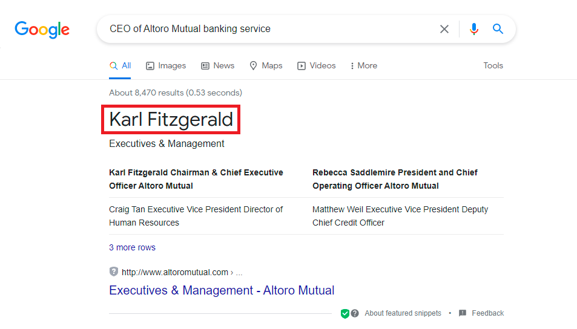
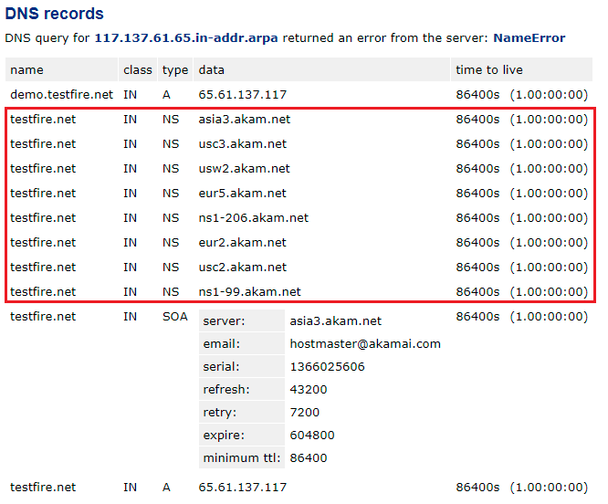
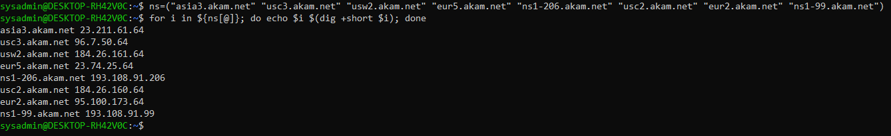

## Week 16 Homework Submission File: Penetration Testing 1

#### Step 1: Google Dorking


- Using Google, can you identify who the Chief Executive Officer of Altoro Mutual is:

**Answer:**

**Karl Fitzgerald** is the CEO of Altoro Mutual Banking Service



- How can this information be helpful to an attacker:

**Answer**

Our lives are increasingly connected by social media. As a general rule, the top man of a company creates his own brand image, as it reflects the vibe, posture, and poise of the organization. The first step to this process of image branding is for a person to share their professional information on a site like LinkedIn, including their contact information. It provides a reconnaissance avenue for a malicious netizen.

In this way, a threat actor can easily, 

- Collect email addresses for phishing or spear phishing
- Send executable payloads over Linkedin Chats to get backdoor access
- Moreover, exploitation may be conducted in various other social engineering methods

#### Step 2: DNS and Domain Discovery

Enter the IP address for `demo.testfire.net` into Domain Dossier and answer the following questions based on the results:

  1. Where is the company located:

  **Answer**

    - Registrant Street: Not Disclosed
    - Registrant City: Sunnyvale
    - Registrant State/Province: CA
    - Registrant Postal Code: 94085
    - Registrant Country: US
  
  2. What is the NetRange IP address:

  **Answer**

  NetRange: 65.61.137.64 - 65.61.137.127

  3. What is the company they use to store their infrastructure:

  **Answer**

    - CustName:       Rackspace Backbone Engineering
    - Address:        9725 Datapoint Drive, Suite 100
    - City:           San Antonio
    - StateProv:      TX
    - PostalCode:     78229
    - Country:        US 

  4. What is the IP address of the DNS server:

  **Answer**

  There are Eight DNS Servers being used for name resoluton

  

  IP Address of Each Name Server

  

  BASH Commands for copy and paste execution
 
  ```
  ns=("Asia3.akam.net" "usc3.akam.net" "eur5.akam.net" "usc2.akam.net" "eur2.akam.net")
  for i in ${ns[@]}; do echo $i $(dig +short $i); done
  ```

    - asia3.akam.net 23.211.61.64
    - usc3.akam.net 96.7.50.64
    - usw2.akam.net 184.26.161.64
    - eur5.akam.net 23.74.25.64
    - ns1-206.akam.net 193.108.91.206
    - usc2.akam.net 184.26.160.64
    - eur2.akam.net 95.100.173.64
    - ns1-99.akam.net 193.108.91.99

#### Step 3: Shodan

- What open ports and running services did Shodan find:

#### Step 4: Recon-ng

- Install the Recon module `xssed`. 
- Set the source to `demo.testfire.net`. 
- Run the module. 

Is Altoro Mutual vulnerable to XSS: 

### Step 5: Zenmap

Your client has asked that you help identify any vulnerabilities with their file-sharing server. Using the Metasploitable machine to act as your client's server, complete the following:

- Command for Zenmap to run a service scan against the Metasploitable machine: 
 
- Bonus command to output results into a new text file named `zenmapscan.txt`:

- Zenmap vulnerability script command: 

- Once you have identified this vulnerability, answer the following questions for your client:
  1. What is the vulnerability:

  2. Why is it dangerous:

  3. What mitigation strategies can you recommendations for the client to protect their server:

---
© 2020 Trilogy Education Services, a 2U, Inc. brand. All Rights Reserved
