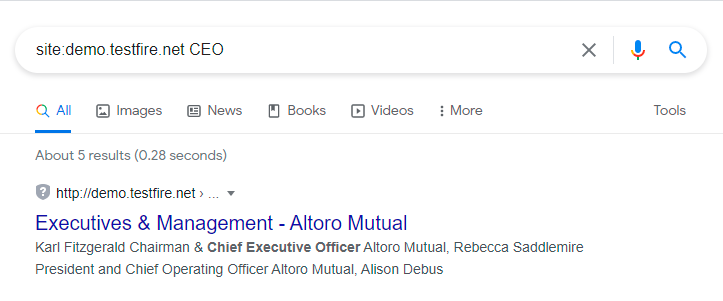
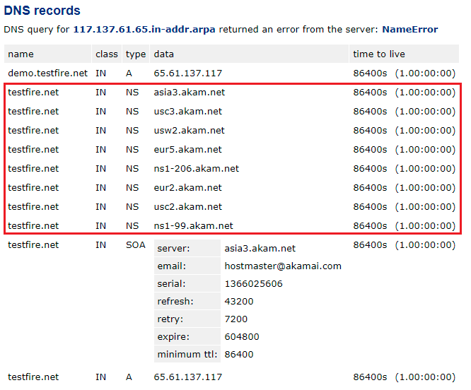
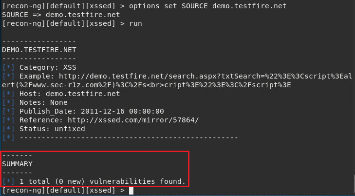
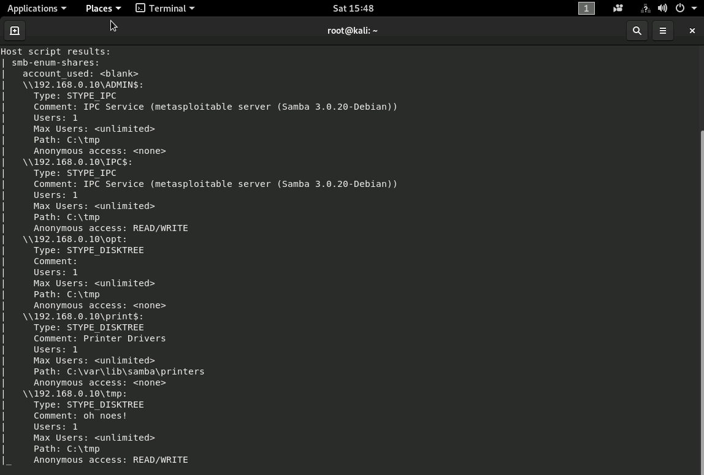

## Week 16 Homework Submission File: Penetration Testing 1

#### Step 1: Google Dorking


- Using Google, can you identify who the Chief Executive Officer of Altoro Mutual is:

  **Answer:**

  **Karl Fitzgerald** is the CEO of Altoro Mutual Banking Service

  

- How can this information be helpful to an attacker:

  **Answer**

  Our lives are increasingly connected by social media. As a general rule, the top man of a company creates his own brand image, as it reflects the vibe, posture, and poise of the organization. The first step to this process of image branding is for a person to share their professional information on a site like LinkedIn, including their contact information. It provides a reconnaissance avenue for a malicious netizen.

  In this way, a threat actor can easily, 

  - Collect email addresses for phishing or spear phishing
  - Send executable payloads over Linkedin Chats to get backdoor access
  - Moreover, exploitation may be conducted in various other social engineering methods

#### Step 2: DNS and Domain Discovery

  Enter the IP address for `demo.testfire.net` into Domain Dossier and answer the following questions based on the results:

  - Where is the company located:  

    **Answer**
      
    ```
    Registrant Street:          Not Disclosed
    Registrant City:            Sunnyvale
    Registrant State/Province:  CA
    Registrant Postal Code:     94085
    Registrant Country:         US
    ```
  
  - What is the NetRange IP address:

    **Answer**

    ```
    NetRange: 65.61.137.64 - 65.61.137.127
    ```

  - What is the company they use to store their infrastructure:

    **Answer**

    ```
    CustName:       Rackspace Backbone Engineering
    Address:        9725 Datapoint Drive, Suite 100
    City:           San Antonio
    StateProv:      TX
    PostalCode:     78229
    Country:        US 
    ```

  - What is the IP address of the DNS server:

    **Answer**

    There are Eight DNS Servers being used for name resoluton

    

    IP Address of Each Name Server

    

    BASH Commands for copy and paste execution
 
    ```
    ns=("Asia3.akam.net" "usc3.akam.net" "eur5.akam.net" "usc2.akam.net" "eur2.akam.net")
    for i in ${ns[@]}; do echo $i $(dig +short $i); done
    ```
    Output

    ```
    asia3.akam.net    23.211.61.64
    usc3.akam.net     96.7.50.64
    usw2.akam.net     184.26.161.64
    eur5.akam.net     23.74.25.64
    ns1-206.akam.net  193.108.91.206
    usc2.akam.net     184.26.160.64
    eur2.akam.net     95.100.173.64
    ns1-99.akam.net   193.108.91.99
    ```

    **Note:**

    This question is a bit confusing for me to distinguish between the expected answer for "DNS server" or "DNS name" of Fully Qualified Doman Name (FQDN) `demo.testfire.net`.

    If it is asked for DNS Name of a FQDN `demo.testfire.net` then the obtained IP is,

    ```
    65.61.137.117
    ```

#### Step 3: Shodan

- What open ports and running services did Shodan find:

   Open Ports: 80 443 8080
   
   Services,

        80   Apache Tomcat/Coyote JSP engine (HTTP)
        443  Apache Tomcat/Coyote JSP engine (HTTPS)
        8080 Apache Tomcat/Coyote JSP engine (HTTP)

#### Step 4: Recon-ng

- Install the Recon module `xssed`.

    **Answer**

    

- Set the source to `demo.testfire.net`. 

    **Answer**

    

- Run the module. 

    **Answer**

    

  Is Altoro Mutual vulnerable to XSS: 

    **Answer**

    


Yes one vulnerabiliy has been found by **`recon-ng`**

#### Step 5: Zenmap

Your client has asked that you help identify any vulnerabilities with their file-sharing server. Using the Metasploitable machine to act as your client's server, complete the following:

- Command for Zenmap to run a service scan against the Metasploitable machine:

    **Answer:**
    ```
    nmap -sV 192.168.0.10
    ```

- Bonus command to output results into a new text file named `zenmapscan.txt`:

    **Answer**
    
    ```
    namp -sV 192.168.0.10 -oN zenmapscan.txt 
    ```

    OR

    ```
    namp -sV 192.168.0.10 -oN nmapscan.txt
    ```

- Zenmap vulnerability script command:

    **Answer**
    ```
    nmap -p139,445 -script=smb-enum-shares 192.168.0.10
    ```
    Output

    

- Once you have identified this vulnerability, answer the following questions for your client:

  1. What is the vulnerability:

        **Answer**
    
        CVE-1999-0520
        
        Current Description:
        
        Inappropriate access control for a system-critical NETBIOS/SMB file share.
        
  2. Why is it dangerous:

        **Answer**
    
        In access-based enumeration, only the files and folders that have been given permission to access are displayed. When a user does not have Read permissions (or equivalent) for a folder, Windows hides the folder from the user. This feature is only applicable when viewing files and folders in a shared folder; it is not applicable when viewing files and folders in the local file system.

  3. What mitigation strategies can you recommendations for the client to protect their server:

        **Answer**
        
        Put a password on the share and make the NetBIOS port inaccessible.

        **Put it all together**

        |          | Description |
        |----------|--------|  
        | **Nmap-Script** | smb-enum-shares |
        | **CVE** | CVE-1999-0520 |
        | **Category** | SMB/NetBIOS |
        | **Type** | Attack |
        | **Risk** | Medium |
        | **Summary** | In access-based enumeration, only the files and folders that have been given permission to access are displayed. When a user does not have Read permissions (or equivalent) for a folder, Windows hides the folder from the user. This feature is only applicable when viewing files and folders in a shared folder; it is not applicable when viewing files and folders in the local file system. |
        | **Impact** | The shares are accessible remotely by hackers. |
        | **Solution** | Put a password on the share and make the NetBIOS port inaccessible. |

---
© 2020 Trilogy Education Services, a 2U, Inc. brand. All Rights Reserved
